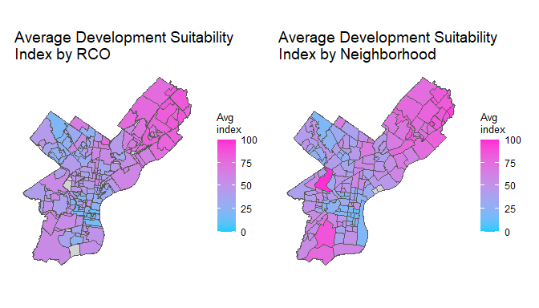
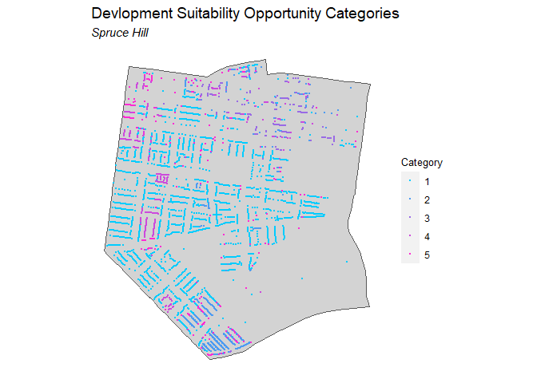
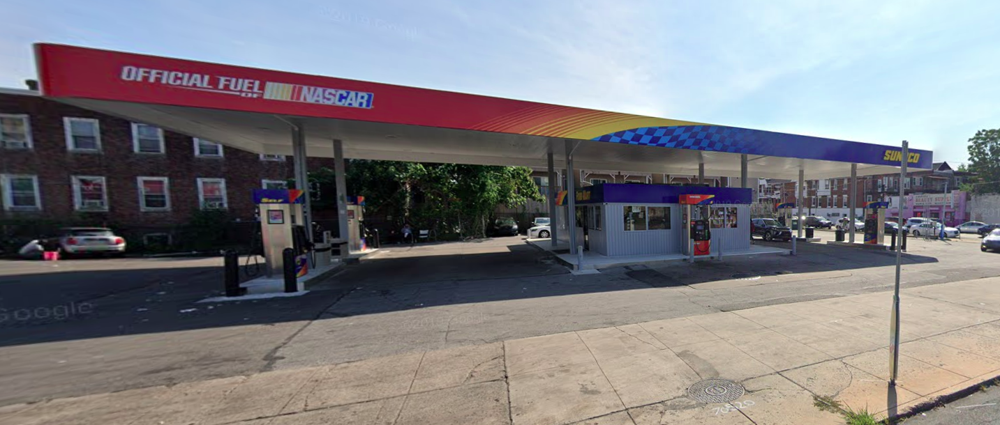
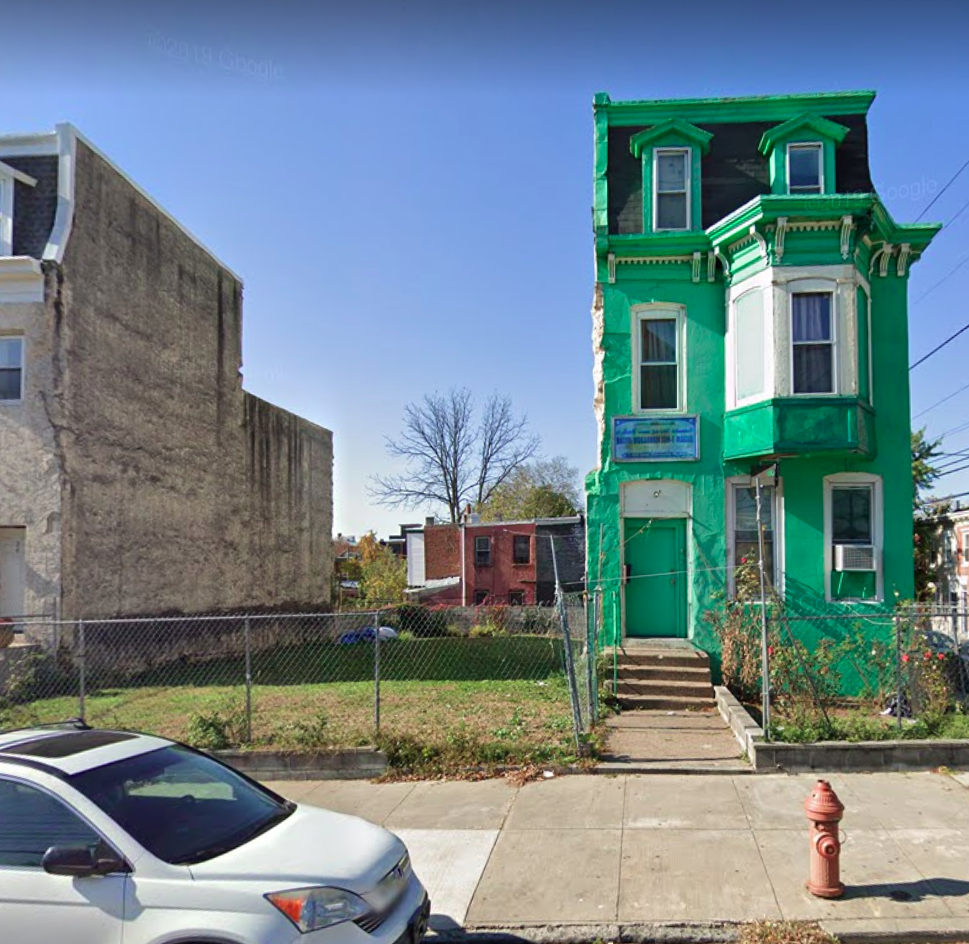
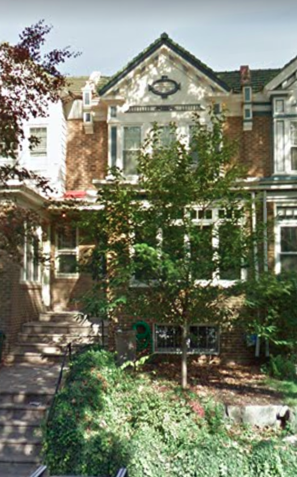
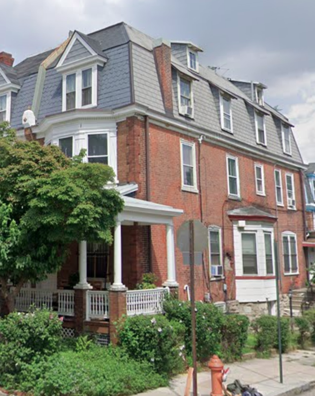
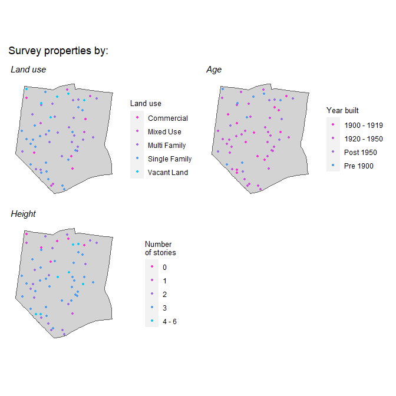

</img>

<h4 align="center">June 2021</h4>

 

## Introduction

The purpose of this document is to explain the data science solutions designed for OurPlan. We begin with a short motivation and then jump into the methods.

Land use planning in cities is a fragmented process that can make community engagement difficult. Developers, local elected officials, neighborhood groups, and planning commissions are all involved, but the average resident is often left out. When a community does get a say in development, historical inequality silences the voices of those who lack political capital.

As urban neighborhoods around the U.S. attract new residents, new tools are needed to democratize the land use planning process. With new residents, comes changing preferences for development – like more housing and retail. Incumbent residents may wish to preserve the historical nature of their neighborhood or protect residents from cultural disenfranchisement. Others see new development as a way to promote diversity and affordability. Democratization of land use planning means balancing these two forces - preservation and development. Without doing so, long-term residents may face displacement and the culture that once defined an area may be lost.

OurPlan helps neighborhoods promote this balance with community engagement, both online and in person. The data science tools we have developed are no substitute for on-the-ground community engagement. However, assuming we can bridge the digital divide, OurPlan’s data solutions may help promote awareness that land use planning matters.

### What is OurPlan?

OurPlan integrates technology into the community engagement process to help communities better express their development preferences and more easily participate in the land use planning process. OurPlan has three goals: 1) to educate residents about the importance and history of land use planning; 2) to allow residents to explore data about their neighborhood through online maps; and 3) to engage community members with a survey they can use to express their land use preferences.

When the plan is completed, stakeholders can use OurPlan to compare the development suitability and community preservation preference _for each property_ – and put it to use when making land use recommendations.

OurPlan is populated with free and open source ‘open data’, provided by city governments. The platform operates on some simple data science solutions, which we explain here. There are three primary algorithms including:

_Community Preference Survey_ – Community engagement is at the heart of the OurPlan process. The Survey tool is a photo survey asking users to comment on the preservation suitability for a set of properties. Section 2 outlines how we draw a representative sample of properties from across the neighborhood. We also ask users to choose their neighborhood, so we can ensure survey responses come from a balanced group of participants.

_Development Suitability Index_ – A development is particularly appealing if the current zoning allows for a ‘higher and better use.’ In other words, does the current (aka. ‘by-right’) zoning allow a one-story retail parcel to be replaced with a four-story condo? If so, the return on investment for a developer is great. The Development Suitability Index maps where this potential is greatest.

_Community Preference Index_ – Once we have collected hundreds of Community Preference Surveys on individual properties, a regression model extrapolates preservation preference to every property neighborhood-wide. The goal is to be descriptive here – generating a signal from the average sentiment of survey takers. Our current tool is only designed for historical preservation and not cultural. The latter requires more local nuance, which we hope to build in future iterations.

## Methods
### Development Suitability Index

There are several reasons why a developer may want to redevelop a property, but mainly developers choose parcels that have not reached their 'highest and best use.' More times than not, a developer will avoid the cost and political hassle of a zoning variance if the current zoning allows them to develop a bigger building than what currently stands.

Cities have zoning codes that dictate how much and where development can occur. Zoning codes often use Floor Area Ratio (FAR) to describe the maximum size of a potential development. FAR is [defined](https://metrocouncil.org/Handbook/Files/Resources/Fact-Sheet/LAND-USE/How-to-Calculate-Floor-Area-Ratio.aspx#:~:text=Floor%20area%20ratio%20(FAR)%20is,the%20building%20is%20located%20on.&text=Typically%2C%20FAR%20is%20calculated%20by,upon%20which%20it%20is%20built.) as 'the measurement of a building's floor area in relation to the size of the lot/parcel that the building is located on.'

While the zoning code will provide a maximum FAR for different land uses, the current FAR can be easily be calculated for any parcel by dividing the gross floor area of a building by the area of the parcel on which it is built. Development below the maximum FAR are properties that have unmet potential and can be developed without a zoning variance or a change to the zoning code.

OurPlan’s Development Suitability Index calculates how much room for development each property currently has. The following sections describe the data used in the calculation, the process for filling in missing data, and how to create the index.

#### Zoning data

As mentioned, all data used for OurPlan is open source and comes from Philadelphia's Open Data [site](https://www.opendataphilly.org/). For the development suitability index, two main datasets are used:

  1. The [properties](https://www.opendataphilly.org/dataset/opa-property-assessments) dataset that contains characteristics and assessment history for every property in Philadelphia.
  2. [Department of Records property parcels](https://www.opendataphilly.org/dataset/property-parcels) which are used to calculate parcel area.

Datasets are linked together using Office of Property Assessment (OPA) number. Double check documentation for each dataset as this identifier is often named differently depending on the dataset.

To begin, we collected the land use designation (i.e. residential, commercial, etc.), zoning code, and various property characteristics from the properties dataset. For this analytic, number of stories and total livable area are key characteristics to include.

The zoning code in this data does not provide an explanation of the requirements for each zoning code. To find this information, we turn to Philadelphia's [Zoning Guide](https://www.phila.gov/media/20200213115058/NEW-ZONING-GUIDE_2020.pdf). This document provides maximum FAR for each zoning type, however, for most residential uses and some mixed-use codes, the code does not use FAR to control development. Instead, the code designates a maximum height for these type of properties. We join the maximum height or maximum FAR for each zoning code to the property data.

When calculating the index, we look at this data as two groups: properties limited by a maximum height and properties restricted by a maximum FAR.

#### Replacing missing data

Most properties have at least some missing data associated with it, and in this case, we are most concerned when the number of stories is missing. Knowing the current height of a property is critical for properties that are limited by a maximum height in the zoning code. In the properties dataset, unknown data is set to `0`. To replace this missing data, we use a Nearest Neighbor analysis to impute how many stories currently exist.

In practice, an imputed number of stories is the average of its nearby neighbors, assuming buildings in close proximity were developed at similar times and in similar styles. The results depend on how many neighbors are defined. We tested three different values - three neighbors, four neighbors, and five neighbors - and chose by comparing each to ground-truthed data.

There are some properties, such as vacant land and parking lots, where zero stories reflects the existing condition. Nearest Neighbor analysis was not used to impute number of stories for these properties. For the remaining properties with missing data, the average number of stories of their three nearest neighbors was calculated and used in the following steps.

#### Calculating the index

Recall, there are two groups - properties limited by a maximum height and properties restricted by a maximum FAR. To create the index for the former, the height of the property is calculated by multiplying the number of stories by 10 feet per story. We then subtract the current height from the maximum height. The difference is scaled from 1 to 100, where 100 indicates a parcel with the greatest room for development.

For parcels with zoning defined by a maximum FAR, FAR is calculated by dividing the total gross area of the property by the area of the lot. The area of the building is found in the properties dataset as ‘total livable area’. To create the Index, the current FAR is subtracted from the maximum FAR provided in the zoning code. Again, the difference is scaled from 1 to 100.

The scaled results from both groups are combined into the Development Suitability Index.

#### Results

The results of the Development Suitability Index are looked at citywide and at the property level below. The following maps plot the index by RCO and by neighborhood and both indicate that areas already developed (i.e. Center City) are less likely to have unmet potential compared to other areas on the edges of Philadelphia.

<!-- -->

Below, the development suitability index is mapped for the Spruce Hill neighborhood. The index is divided into five ‘opportunity categories’ that visualize the data as quintiles. Category `5` are properties with the greatest likelihood of being developed (an index of 80 or greater).

<!-- -->

The map shows that properties most likely to be developed according to the index are located near commercial corridors, such as Market or Chestnut Streets in the north of Spruce Hill. Let’s take a look at some of these properties.

On Chestnut Street, between 46th and Farragut Street, `opa_account_num` 882147100 corresponds to a gas station.

</img>

 

The properties dataset says this is a one story property and the zoning code limits this property with a maximum height of 38 feet. Ultimately this property is given a Development Suitability Index score of 92, which correctly reflects the high potential for development at this location.

Also along the commercial corridors, at the corner of 43rd Street and Ludlow Street, `opa_account_num` 272113205 is a three-story row home with a side yard. However, this parcel is zoned as CMX-4 which has a maximum FAR of 500. The current FAR calculation is 0.42 based on a livable area of 2,250 square feet and parcel area of approximately 5,375 square feet. This property is given a Development Suitability Index score of 78. It is important to remember that this index is calculated citywide. The potential FAR in other parts of the city - namely Center City - does influence the scores for buildings like this in Spruce Hill.

 

</img>

 
The index picks up on development potential in other areas of the neighborhood as well. There is a group of residential properties near 46th and Baltimore Ave that are assigned high development suitability index scores. For example, `opa_account_num` 461045200 is a two-story row home.

</img>

 
The zoning code dictates a maximum height of 38 feet for this property - or up to two stories of unmet development potential. This property receives a Development Suitability Index score of 61, which puts this property in the second highest category for development likelihood.

The index also reflects properties where development is less likely without a variance or change to the zoning code. At the corner of 44th Street and Osage Ave is a three-story row home (`opa_account_num` 272127700).

</img>

 
The nearest neighbor calculation imputed three stories for this property as the number of stories, putting the current height at 30 feet. The zoning code limits this property to a maximum height of 38 feet. Most likely a developer would not be attracted to this property without a change to the zoning code as the return on investment as is, would not be high.

The Development Suitability Index can be explored further at the property level in the Mapping Explorer component of OurPlan.

### Preservation Preference Index

Coming soon!

### Community Preference Survey

The Community Preference Survey is how we engage residents online about their preservation preferences. Great thought was put into which properties were chosen for the survey – ensuring a representative swath of neighborhood land uses were sampled. Three surveys were created, each including 20 photos of various land use types. Our representative sample should include properties from across the neighborhood (spatially) as well as properties that reflected the land use composition of the area.

First, we needed to understand the breakdown of properties in our neighborhood. Using the properties dataset, we found the percent of properties by land use type, the age of properties, and the number of stories. Below is the breakdown across in the Spruce Hill neighborhood:

<table class="table table-condensed" style="margin-left: auto; margin-right: auto;">
 <thead>
  <tr>
   <th style="text-align:left;"> landuse </th>
   <th style="text-align:right;"> Number_Properties </th>
   <th style="text-align:left;"> Percent </th>
  </tr>
 </thead>
<tbody>
  <tr>
   <td style="text-align:left;"> Commercial </td>
   <td style="text-align:right;"> 165 </td>
   <td style="text-align:left;"> 4.29% </td>
  </tr>
  <tr>
   <td style="text-align:left;"> Industrial </td>
   <td style="text-align:right;"> 10 </td>
   <td style="text-align:left;"> 0.26% </td>
  </tr>
  <tr>
   <td style="text-align:left;"> Mixed Use </td>
   <td style="text-align:right;"> 136 </td>
   <td style="text-align:left;"> 3.54% </td>
  </tr>
  <tr>
   <td style="text-align:left;"> Multi Family </td>
   <td style="text-align:right;"> 1433 </td>
   <td style="text-align:left;"> 37.27% </td>
  </tr>
  <tr>
   <td style="text-align:left;"> Single Family </td>
   <td style="text-align:right;"> 1878 </td>
   <td style="text-align:left;"> 48.84% </td>
  </tr>
  <tr>
   <td style="text-align:left;"> Vacant Land </td>
   <td style="text-align:right;"> 223 </td>
   <td style="text-align:left;"> 5.80% </td>
  </tr>
</tbody>
</table>

We categorized `year_built` into four categories - Pre 1900, 1900 - 1919, 1920 - 1950, and Post 1950 - to understand the age of properties in the neighborhood.

<table class="table table-condensed" style="margin-left: auto; margin-right: auto;">
 <thead>
  <tr>
   <th style="text-align:left;"> year_built_cat </th>
   <th style="text-align:right;"> Number_Properties </th>
   <th style="text-align:left;"> Percent </th>
  </tr>
 </thead>
<tbody>
  <tr>
   <td style="text-align:left;"> 1900 - 1919 </td>
   <td style="text-align:right;"> 922 </td>
   <td style="text-align:left;"> 24.0% </td>
  </tr>
  <tr>
   <td style="text-align:left;"> 1920 - 1950 </td>
   <td style="text-align:right;"> 2024 </td>
   <td style="text-align:left;"> 52.6% </td>
  </tr>
  <tr>
   <td style="text-align:left;"> Post 1950 </td>
   <td style="text-align:right;"> 299 </td>
   <td style="text-align:left;"> 7.8% </td>
  </tr>
  <tr>
   <td style="text-align:left;"> Pre 1900 </td>
   <td style="text-align:right;"> 600 </td>
   <td style="text-align:left;"> 15.6% </td>
  </tr>
</tbody>
</table>

Finally we looked at how the height of properties varied.

<table class="table table-condensed" style="margin-left: auto; margin-right: auto;">
 <thead>
  <tr>
   <th style="text-align:left;"> num_stories_cat </th>
   <th style="text-align:right;"> Number_Properties </th>
   <th style="text-align:left;"> Percent </th>
  </tr>
 </thead>
<tbody>
  <tr>
   <td style="text-align:left;"> 1 </td>
   <td style="text-align:right;"> 64 </td>
   <td style="text-align:left;"> 2.3% </td>
  </tr>
  <tr>
   <td style="text-align:left;"> 2 </td>
   <td style="text-align:right;"> 761 </td>
   <td style="text-align:left;"> 27.5% </td>
  </tr>
  <tr>
   <td style="text-align:left;"> 3 </td>
   <td style="text-align:right;"> 1600 </td>
   <td style="text-align:left;"> 57.7% </td>
  </tr>
  <tr>
   <td style="text-align:left;"> 4 - 6 </td>
   <td style="text-align:right;"> 334 </td>
   <td style="text-align:left;"> 12.1% </td>
  </tr>
  <tr>
   <td style="text-align:left;"> Over 6 </td>
   <td style="text-align:right;"> 12 </td>
   <td style="text-align:left;"> 0.4% </td>
  </tr>
</tbody>
</table>

Once we understood the composition of land uses in Spruce Hill, these percentages helped us choose sample properties for the three photo surveys. In other words, each survey is representative of the land use, age of buildings, and number of stories of properties found in the community. The maps below plot the properties used in the surveys by characteristic.

